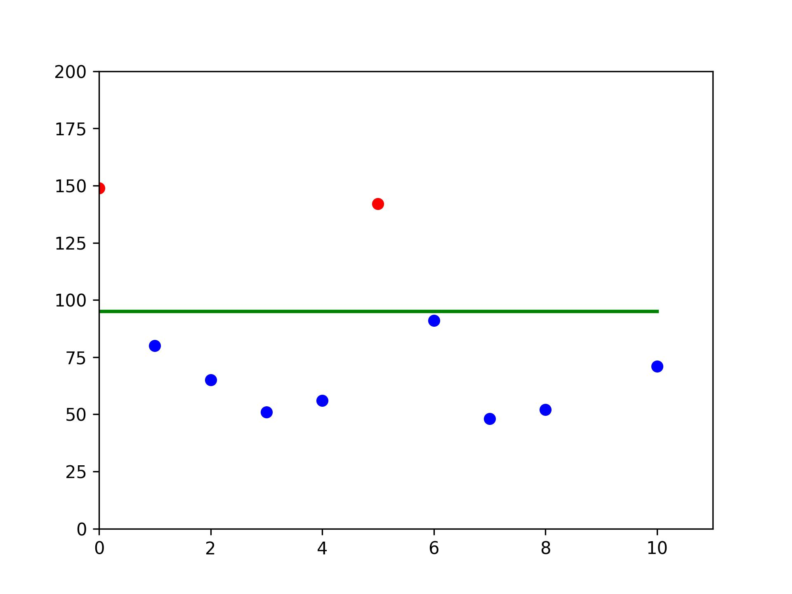
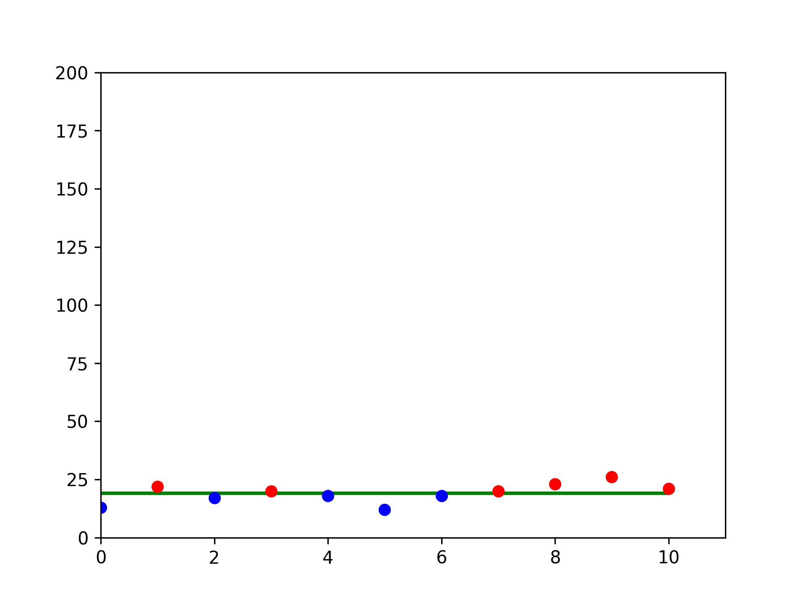
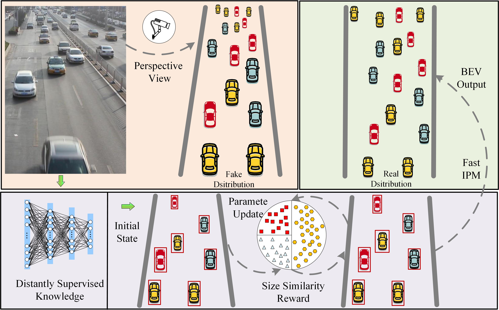

# Distantly Supervised Deep Reinforcement Learning for Object Distribution Estimation in Real World
## Training Preparation
### ● Environment
☑️pytorch 1.8.1  
☑️CUDA 11.4  
☑️python 3.8.10  

### ● Available GPU IDs
Modify the available GPU devices in [config.py](config.py)


### ● Detection Checkpoint
The pre-trained detection can be downloaded from [here](https://drive.google.com/file/d/1v2JMlqzPjE706zPHKTq5485GH1wJArZN/view?usp=drive_link)

## Training
Run ```python train.py```

## Dataset Download

You can download UA-DETRAC dataset [here](https://universe.roboflow.com/cs474-ug2-vehicle-detection/ua-detrac-rvwkg/dataset/2). 
Note that we build a vanishing point dataset based on UADETRAC dataset to validate the effectiveness of the proposed method. 
Because we think this contribution is small, we ignore this contribution in the paper.
The self-relabeled dataset based on UADETRAC will be public when this paper get a revision comment.


## Detection Prior
In this paper, we pretrain a detector to acquire object prior knowledge. We have provided the pretrained checkpoint as above. The detector is shown in [VGG_C.py](VGG_C.py) And the whole training code of the detector will also be public soon.

## Visualization
The car sizes before and after applying our method is visualized as follows：  
 
  
Below is the simple framework of this work:   

